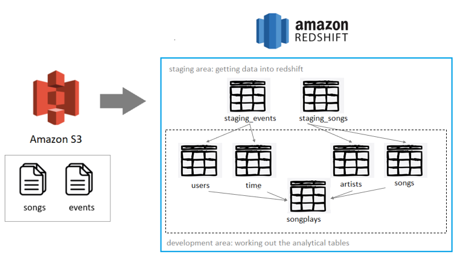

#### Challenge

In this project, you'll act as a data engineer for a music streaming startup called Sparkify.

Sparkify has grown its user base and song database and wants to move its processes, data, and data analytics applications onto the cloud.

Their data resides in S3, in a directory of JSON logs on user activity on the app, and a directory with JSON metadata for the songs in their app. As their data engineer, you will be tasked with building an ETL pipeline that extracts their data from S3, stages them in Redshift, and transforms data into a set of dimensional tables for their analytics team to continue finding insights into what songs their users are listening to.

Therefore, the purpose of this database is to enable Sparkify teams to answer business questions about its users such as most played artists, songs and etc. 

##### Datasets

1. Song data: s3://udacity-dend/song_data

The song files are partitioned by the first three letters of each song's track ID. For example, here are file paths to two files in this dataset. Example:

song_data/A/B/C/TRABCEI128F424C983.json
song_data/A/A/B/TRAABJL12903CDCF1A.json

2. Log data: s3://udacity-dend/log_data

3. This third file s3://udacity-dend/log_json_path.jsoncontains the meta information that is required by AWS to correctly load s3://udacity-dend/log_data

##### Tables

We will use the files above to create and populate the following tables:

The schema was built into a star schema architecture aiming to improve query performance. Some tables were given distkeys such as distyle all (so the small tables can be copied across different nodes) combined with sortkeys to further speed up performance.

##### Instructions

1. Fill your AWS credentials and review overall cluster and region configuration inside the dwh.cfg file
2. Open the jupyter notebook setup.ipynb to create the IAM role and Cluster. Make sure the cluster is already available before checking the connection and do not forget to update the dwh.cfg file with the cluster's endpoint
3. Run create_tables.py to create the tables
4. Run etl.py to load S3 data into the staging tables and insert records in the analytcal tables that should be used for the final queries. Keep in mind that the ETL might take up to 15-30 minutes depending on the cluter configuration and dataset or subsets used.
5. You can optionally check data in the "Verifying Redshift" notebook or use the Redshift query editor directly
6. Destroy resources calling cleanup.py
